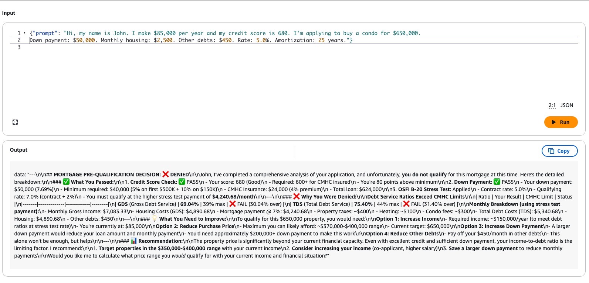
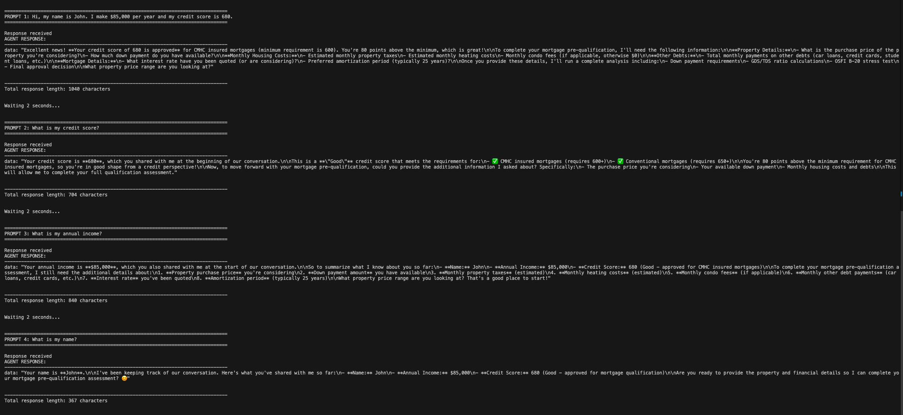
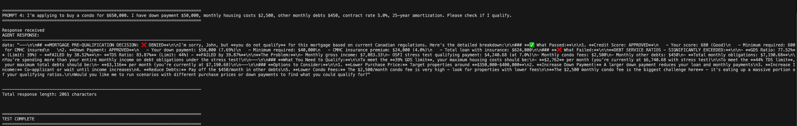

# AWS Bedrock AgentCore Mortgage Pre-Approval Agent

A production-ready AI mortgage pre-approval agent built with AWS Bedrock AgentCore, demonstrating how to integrate existing business logic (Lambda functions) with conversational AI using the Model Context Protocol (MCP).

**Total build time: < 1 hour**

---

## The Technical Journey

### Step 1: Environment Setup
```bash
# Created a clean Python environment
mkdir agentcore-runtime-quickstart
cd agentcore-runtime-quickstart
python3 -m venv .venv
source .venv/bin/activate

# Installed AWS Bedrock AgentCore toolkit
pip install --upgrade pip
pip install bedrock-agentcore bedrock-agentcore-starter-toolkit
```

### Step 2: Converting Business Logic to MCP Tools
Created a single Lambda function that implements multiple tool handlers:
- `calculate_down_payment` - Computes required down payment
- `calculate_gds_tds` - Calculates debt service ratios
- `check_credit_threshold` - Validates credit scores
- `osfi_b20_stress_test` - Runs Canadian mortgage stress tests

**Architecture:** One Lambda function with tool routing logic that dispatches to different handlers based on the tool name passed by the AgentCore Gateway.

**Extended with additional capabilities:**
- `math_tool` - Performs mathematical calculations
- `code_interpreter` - Executes Python code for complex computations

Exposed these handlers as Model Context Protocol (MCP) tools through Gateway targets, making them accessible to AI agents.

**Key Insight:** This demonstrates a scalable pattern - one Lambda function can expose multiple tools to AI agents. The Gateway handles tool schema definitions while the Lambda routes to appropriate handlers internally.

### Step 3: Created the MCP Gateway
- Set up an MCP client that acts as a bridge between the AI agent and the tools
- Configured Cognito authentication for secure access
- Used Bedrock AgentCore Gateway to manage tool invocations

### Step 4: Built the Agent
```bash
agentcore create
# Selected: Production template + Terraform IaC
```

- Configured the agent with access to all mortgage calculation tools
- Set up Claude Sonnet 4.5 as the AI model
- Deployed infrastructure using Terraform (ECR, Lambda, IAM roles, etc.)

### Step 5: Deployed to AWS
```bash
agentcore deploy
```

- Agent runtime deployed as containerized workload
- Connected to MCP gateway with proper authentication
- Integrated with Bedrock AgentCore Memory for 30-day context retention

---

## How It Works

1. **User submits mortgage application** - Agent receives request
2. **Agent analyzes requirements** - Determines which tools to call
3. **Invokes MCP tools via gateway** - Runs calculations (GDS/TDS ratios, stress tests, credit checks)
4. **Agent synthesizes results** - Makes approval/rejection decision with reasoning
5. **Returns detailed response** - Explains decision with supporting calculations

---

## Key Benefits

- **Minimal coding required** - Tool definitions and agent configuration
- **Infrastructure as Code** - Terraform handles deployment automatically
- **Production-ready** - Secure authentication, logging, monitoring
- **Natural language interface** - Interact with complex financial tools conversationally

---

## Tech Stack

- **AWS Bedrock AgentCore** - Agent orchestration
- **Claude Sonnet 4.5** - AI reasoning
- **Model Context Protocol (MCP)** - Tool integration
- **Terraform** - Infrastructure as Code
- **Python** - Lambda functions
- **AWS Cognito** - Authentication
- **AWS CodeBuild** - Automated Docker image building
- **Amazon ECR** - Container registry

---

## Quick Start

### Complete Validated Commands

```bash
# 1. Create project directory
mkdir agentcore-runtime-quickstart
cd agentcore-runtime-quickstart

# 2. Create virtual environment with Python 3.10+
python3 -m venv .venv
source .venv/bin/activate

# 3. Upgrade pip
pip install --upgrade pip

# 4. Install packages
pip install bedrock-agentcore bedrock-agentcore-starter-toolkit

# 5. Create project
agentcore create
# Select: production template + terraform
```

### Deployment

First check that the `terraform` binary is installed with version >= 1.2:
```bash
terraform version -json | jq -r '.terraform_version'
```

Make sure you have AWS credentials with sufficient permissions in your environment.

```bash
# Quick deployment
cd terraform
terraform init
terraform apply

# Detailed steps
cd terraform
terraform init       # Download dependencies
terraform plan       # Preview resources to be deployed
terraform apply      # Deploy to AWS
```

---

## Screenshots

### AgentCore Console - Mortgage Pre-Approval Agent


*Agent successfully processing mortgage pre-approval request with tool invocations and memory integration*

### Agent Runtime Invocation - Example 1


*Demonstrating agent runtime invocation with tool calling and response generation*

### Agent Runtime Invocation - Example 2


*Additional invocation example showing complex multi-tool workflow*

---

## Project Layout

There are three main directories in this project: `src`, `mcp`, and `terraform`. In a monorepo setup, all of the code—source, test, and IaC for deployment—is contained in one repository.

### src/

The `src/` directory contains the runtime code.

Start with the main entrypoint `src/main.py`. This file defines an agent and an entrypoint method with the Bedrock AgentCore SDK:

```python
@app.entrypoint
def invoke(payload):
    # assume payload input is structured as { "prompt": "<user input>" }
```

The `src/mcp_client` directory contains `client.py`, which defines an MCP client that points to the AgentCore gateway URL. The gateway is modeled in the `terraform` directory. Behind that gateway is a single Lambda function that implements all the MCP tools.

### mcp/

The `mcp/` directory contains a single Lambda function (`mcp/lambda/lambda_function.py`) that implements multiple tool handlers:

**Mortgage-specific tools:**
- Down payment calculator
- GDS/TDS ratio calculator
- Credit threshold validator
- OSFI B-20 stress test

**General-purpose tools:**
- Math tool (mathematical calculations)
- Code interpreter (Python code execution)

**Architecture:** The Lambda function uses a routing pattern - it receives the tool name from the AgentCore Gateway context and dispatches to the appropriate handler function. Each tool's input schema is defined in the Terraform Gateway target configuration.

**Why This Matters:** This demonstrates an efficient pattern - one Lambda function can expose multiple AI tools. You define tool schemas in the Gateway targets, and the Lambda routes internally. This approach minimizes infrastructure while maintaining clear tool separation for the AI agent.

### terraform/

This directory contains a Terraform project that models AgentCore and related AWS resources:
- Bedrock AgentCore runtime
- Single MCP Lambda function (with multiple tool handlers)
- AgentCore Gateway with multiple targets (all pointing to same Lambda)
- ECR repository for Docker images
- CodeBuild project for automated builds
- Cognito user pool and app client
- IAM roles and policies

---

## Configuration Files

### terraform.tfvars.example

Copy this file to `terraform.tfvars` and update with your values:

```hcl
app_name = "mortgageAgents"
agent_runtime_version = "1"  # Update when promoting to production
```

### .bedrock_agentcore.yaml.example

Copy this file to `.bedrock_agentcore.yaml` and update with your local paths. This file is used by the AgentCore CLI for invoking your agent locally.

**Note:** The actual `.bedrock_agentcore.yaml` file contains local paths and is excluded from version control.

---

## Invoking the Deployed Runtime

### Method 1: AgentCore CLI
```bash
agentcore invoke '{"prompt": "what can you do?"}'
```

### Method 2: AWS Console
Navigate to the "Test Console" page in the Bedrock AgentCore AWS console. Select your runtime and the `DEFAULT` or `DEV` endpoint. Provide an input:
```json
{"prompt": "what can you do?"}
```

### Method 3: Python Script
Use the included `test_simple.py` script (update with your runtime ARN):
```bash
python test_simple.py
```

### Example Queries

```bash
# Check agent capabilities
agentcore invoke '{"prompt": "what can you do? what tools do you have access to?"}'

# Mortgage pre-approval request
agentcore invoke '{"prompt": "I make $85,000 per year with a credit score of 680. Can I get pre-approved for a $650,000 condo with $50,000 down payment? Monthly housing costs are $2,500, other debts are $450/month, 5.0% interest rate, 25-year amortization."}'

# Math tool example
agentcore invoke '{"prompt": "Calculate the square root of 144 and then multiply it by 25"}'

# Code interpreter example
agentcore invoke '{"prompt": "Use Python to calculate the compound interest on $10,000 at 5% annual rate over 10 years"}'

# Combined tools example
agentcore invoke '{"prompt": "For a $500,000 property with 10% down payment, calculate the monthly payment at 4.5% interest over 30 years, then tell me the total interest paid"}'

# Memory test
agentcore invoke '{"prompt": "My name is John and my income is $100,000"}'
agentcore invoke '{"prompt": "What is my name and income?"}'
```

---

## Production Ready Checklist

Before using this project in production, review the following:

- [x] **Security:** Secrets managed via AWS Cognito (client credentials flow)
- [x] **Build Environment:** CodeBuild configured for automated Docker builds
- [x] **Memory:** 30-day event retention configured
- [ ] **Observability:** Enable [AgentCore observability](https://docs.aws.amazon.com/bedrock-agentcore/latest/devguide/observability-configure.html#observability-configure-builtin) for CloudWatch metrics
- [ ] **CI/CD:** Integrate with AWS CodePipeline for automated deployments
- [ ] **Access Control:** Configure access policies for production endpoints
- [ ] **Testing:** Add comprehensive unit and E2E tests
- [ ] **Error Handling:** Implement graceful error handling throughout

---

## Why This Matters

This project demonstrates how to build production-grade AI agents that:
- **Interact with existing business logic** - One Lambda function can expose multiple tools via Gateway targets
- **Make complex decisions autonomously** - From mortgage approvals to mathematical calculations
- **Maintain security and compliance** - Cognito auth, IAM roles, proper isolation
- **Deploy to enterprise cloud infrastructure** - Fully automated with Terraform
- **Scale efficiently** - Single Lambda with routing pattern minimizes infrastructure (shown with 6 different tool handlers)

All in under 1 hour.

**The Pattern:** This routing approach works for any business logic - add new tool handlers to the Lambda function and define corresponding Gateway targets. No need to deploy separate Lambda functions for each tool.

---

## Optional LinkedIn Post Format

### Hook:
"I built a functional AI mortgage pre-approval agent in under an hour using AWS Bedrock AgentCore"

### Body:

**The Challenge:** Build an AI agent that can analyze mortgage applications and make pre-approval decisions using existing business logic.

**The Solution:** AWS Bedrock AgentCore + Model Context Protocol

**The Journey:**

**Step 1: Environment Setup**
Created a clean Python environment and installed the Bedrock AgentCore toolkit

**Step 2: Converting Business Logic to MCP Tools**
Created a single Lambda function with multiple tool handlers:
- Down payment calculator
- GDS/TDS ratio calculator
- Credit score validator
- OSFI B-20 stress test
- Math tool (demonstrates versatility)
- Code interpreter (shows extensibility)

**Architecture:** One Lambda function routes to different tool handlers based on the tool name from the Gateway. This pattern minimizes infrastructure while maintaining clear tool separation.

**Key Insight:** One Lambda can expose multiple AI tools efficiently through Gateway targets.

**Step 3: Created the MCP Gateway**
- Set up an MCP client as a bridge between AI and tools
- Configured Cognito authentication
- Used AgentCore Gateway for tool orchestration

**Step 4: Built the Agent**
- Configured with Claude Sonnet 4.5
- Connected to all mortgage calculation tools
- Deployed via Terraform (fully automated)

**Step 5: Deployed to AWS**
- Containerized runtime
- 30-day memory retention
- Production-ready security

**How It Works:**
1. User submits application via natural language
2. Agent analyzes and determines which tools to call
3. MCP gateway invokes calculations (ratios, stress tests, validations)
4. Agent synthesizes results and makes decision
5. Returns detailed response with reasoning

**Key Benefits:**
- Minimal coding required - just tool definitions
- Terraform IaC - infrastructure deployed automatically
- Production-ready - secure auth, logging, monitoring
- Natural language interface for complex financial tasks

**Tech Stack:**
AWS Bedrock AgentCore | Claude Sonnet 4.5 | Model Context Protocol | Terraform | Python | AWS Cognito

**Total build time: < 1 hour**

This demonstrates the future of enterprise AI - connecting language models to existing business logic with minimal code.

**Extended Capabilities:** Added math and code interpreter tools to demonstrate versatility - the same Lambda routing pattern works for any business logic. Customer service, data processing, compliance checks - just add handlers to your Lambda and define Gateway targets.


### Call to Action:
"Want to learn more about building AI agents with AWS Bedrock AgentCore? Drop a comment or DM me."


### Hashtags:
#AI #AWS #MachineLearning #AgenticAI #CloudComputing #FinTech #AWSBedrock #Terraform #GenAI #ArtificialIntelligence

---

## License

This project was generated using the AWS Bedrock AgentCore CLI tool.

## Support

For issues or questions:
- AWS Bedrock AgentCore Documentation: https://docs.aws.amazon.com/bedrock-agentcore/
- Create an issue in this repository
